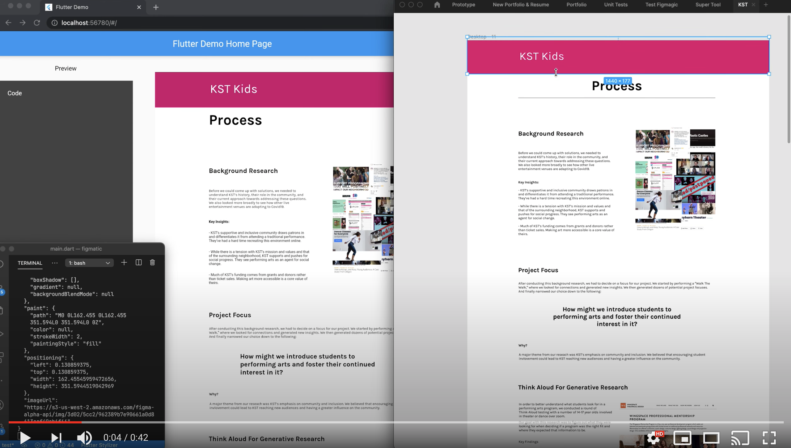

# Figmatic <br>
**A Real Time Figma to Flutter UI Tool**

Project Overview(todo)

[](https://www.youtube.com/watch?v=nFJTGY4vMvw)


**Relavent Resources**

- [Figma Plugin Docs](https://www.figma.com/plugin-docs/intro/)
- [Figma API Docs](https://www.figma.com/plugin-docs/intro/)
- [Awesome Figma](https://github.com/ilyalesik/awesome-figma)
- [Figma API Demo](https://github.com/figma/figma-api-demo)
https://github.com/thomas-lowry/figma-plugins-on-github#plugins
    **Related Software**
- [figma to flutter](https://aloisdeniel.github.io/figma-to-flutter/) by aloisdeniel. This is the closest project to mine. The main difference is that it is just a code generator, I plan to extend my project to include more organizational and prototyping features. He does into detail about it [here](https://aloisdeniel.github.io/introducing-figma-to-flutter/) [Here is a demo of the tool](https://aloisdeniel.github.io/figma-to-flutter/)

- [html-to-figma plugin](https://github.com/BuilderIO/html-to-figma)

- [flutter path draw package](https://github.com/dnfield/flutter_path_drawing) for svg rendering

    **Existing Products**
    Here are a few existing products that build on top of Figma or Sketch
    - [flinto](https://www.flinto.com/) 

## Getting Started<br>
This site is written in Flutter, a cross-platform UI toolkit from google that uses the Dart programming language.

It allows for a flexible way to organize, view, and build upon Figma projects. 


To get an introduction to Flutter, check out Google's Codelabs that enable you to learn the fundamentals online without downloading anything.
 - For a comparison between flutter and other platforms check out these articles:
      - [Introduction to Flutter for Web Developers](https://flutter.dev/docs/get-started/flutter-for/web-devs)
      - [Introduction to Flutter for React Native Developers](https://flutter.dev/docs/get-started/flutter-for/react-native-devs)
      - [Introduction to Flutter for IOS Developers](https://flutter.dev/docs/get-started/flutter-for/ios-devs)
      -[Introduction to Flutter for Android Developers](https://flutter.dev/docs/get-started/flutter-for/android-devs)
- To understand how flutter web works check out this [Web Support for Flutter](https://flutter.dev/web) article


**Required Software** <br/>
If you are interested in contributing, you'll need to download the following software
- [Flutter Web Install SDK](https://flutter.dev/docs/get-started/web)
      - [Windows Install Instructions](https://flutter.dev/docs/get-started/install/windows)    
      - [MacOS Install Instructions](https://flutter.dev/docs/get-started/install/macos)       
      - [Linux Install Instructions](https://flutter.dev/docs/get-started/install/linux)   
      - [ChromeOS Install Instructions](https://flutter.dev/docs/get-started/install/chromeos])
- [Chrome](https://www.google.com/chrome/)
- [Visual Studio Code](https://code.visualstudio.com/)
- [Git](https://git-scm.com/)

## Flutter Environment Set Up <br/>
For this project, we only use Flutter Web, so to get that running on your computer, follow the instructions on [Flutter Web Install SDK](https://flutter.dev/docs/get-started/web). 

The first step is to download the Flutter SDK, no need to set up the Android or IOS development environments. Once you install the SDK, run the command:
```
flutter doctor
```
You should see something similar to what's shown below:

[todo]

Once Flutter is successfully installed, you will need to install [Chrome](https://www.google.com/chrome/)(if it's not already installed) so that you can run your code in the browser during development

Lastly, you will likely want to use Visual Studio Code as your code editor. Go to [Visual Studio Code](https://code.visualstudio.com/) to download the software. Then go to the "extensions" tab on the side and add the flutter extension and dart extension.

[picture below]


**Testing Flutter Install** <br/>
Before you try running this project, make sure flutter is working properly by creating a new project.
/*
Todo
*/

## Setting Project Up Locally <br/>
Once you clone this go to


## Project Overview <br/>


**Setting Up Project Locally**


**Dependencies**


